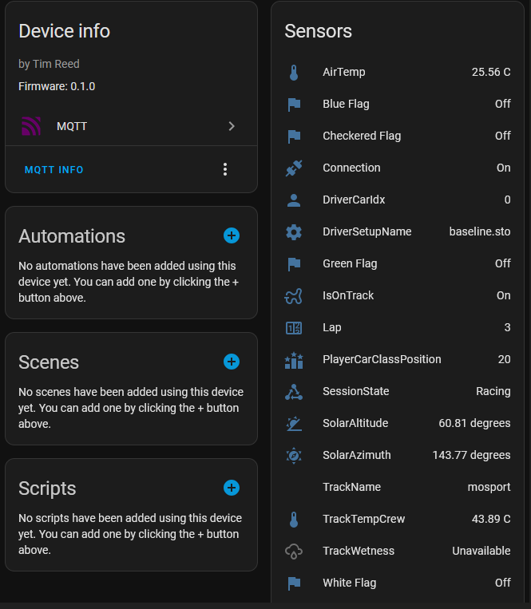

# HomeAssistantIRacingMQTT

Connect real time iRacing telemetry to your Home Assistant.    

Want to lower room lighting when the sun sets in the sim during the 24hr of Le Mans?  
Turn on some fans automatically when you enter a race (we've all forgotten to do this manually, right)?  
Change backlighting LEDS when the yellow / white / checkered / blue flags come out?




## Requirements:

MQTT broker setup on Home Assistant, configured to use websockets (NOTE: this uses a different default port than the regular TCP connection). Mosquitto
uses 1883 (8883 SSL) for normal MQTT, 1884 (8884 SSL) for Websockets.  Check Settings -> Addons -> Mosquitto Broker -> Configuration.  Make sure you have the right one.

Configure an `.env` file. You can copy the `.env-example` and fill in specific.  
Required env vars are:
```
MQTT_HOST="localhost"
MQTT_PORT=1884 #Optional, defaults to 1884
MQTT_USERNAME="user"
MQTT_PASSWORD="password"
```

See https://www.home-assistant.io/integrations/mqtt/ to setup MQTT  

## Build

Clone this repo and then:
```
cargo run --release
```
or 
```
cargo build --release
```
and move / handle the binary as you choose.

Fork to use variables of your choosing.  All variables in telemetry and session data are available.  To see what is available, and furthur discussion on the iRacing telemetry, see https://forums.iracing.com/discussion/62/iracing-sdk/p1 (requires iRacing account)

### Other
Uses custom rust implementation of [ir_telemetry](https://github.com/TimLikesTacos/ir_telemetry) and types for [HA mqtt discovery](https://github.com/TimLikesTacos/ha_mqtt).  